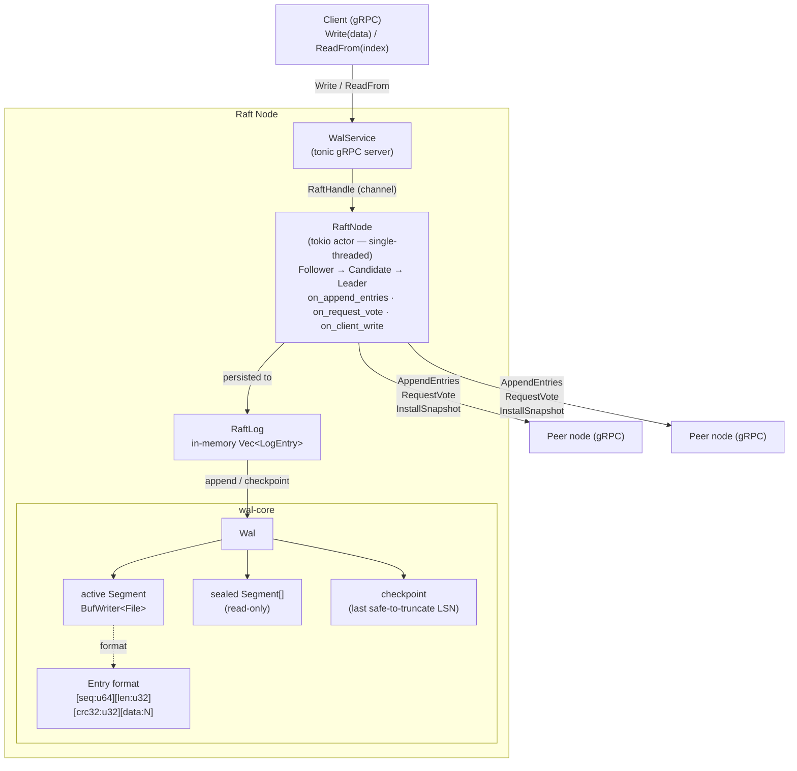
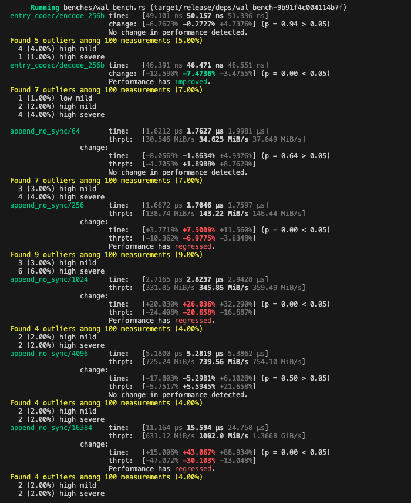
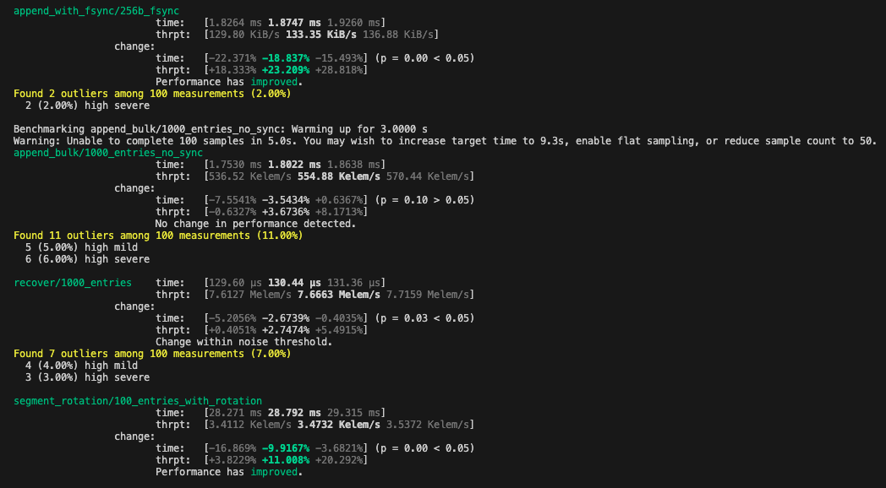

# wal-distributed-rs


[](https://codecov.io/gh/bharath03-a/wal-distributed-rs)

A **production-grade Write-Ahead Log** with Raft-based distributed replication, written entirely in Rust.

Built as a portfolio project to demonstrate expertise in:
- **Systems programming** — crash-safe I/O, segment management, CRC32 integrity checks
- **Distributed systems** — Raft consensus, leader election, log replication, quorum writes
- **Async Rust** — tokio actor model, gRPC via tonic, concurrent peer RPCs
- **Observability** — structured tracing, Prometheus-compatible metrics

---

## Architecture



---

## Crates

| Crate | Description |
|---|---|
| [`wal-core`](crates/wal-core/) | Crash-safe, segment-based WAL engine. Zero async dependencies. |
| [`wal-replication`](crates/wal-replication/) | Raft consensus layer + gRPC server built on top of `wal-core`. |
| [`wal-server`](crates/wal-server/) | Standalone binary — run a Raft node with gRPC + HTTP health/metrics. |

---

## wal-core — Key Concepts

### Entry format

Every entry is written as a 16-byte header followed by the payload:

```
┌──────────────┬─────────────┬──────────────┬──────────────────┐
│ sequence (8) │  len (4)    │  crc32 (4)   │   data (N bytes) │
│  u64 LE      │  u32 LE     │  u32 LE      │                  │
└──────────────┴─────────────┴──────────────┴──────────────────┘
```

- **Sequence number (LSN)**: monotonically increasing, 1-based, global across all segments.
- **CRC32**: detects bit-rot and partial writes. Every decode validates the checksum.

### Segment rotation

The WAL splits entries across fixed-size segment files. When the active segment would
exceed `max_segment_bytes`, it is sealed (fsynced, made read-only) and a new one is
created. Old segments can be deleted independently once they are fully checkpointed.

```
wal-00000000000000000001.seg  ← sealed
wal-00000000000000000002.seg  ← sealed
wal-00000000000000000003.seg  ← active (current writes)
```

### Checkpoint & crash recovery

```rust
// After applying entries to your state machine:
wal.checkpoint(last_applied_seq)?;

// On the next startup, replay only un-applied entries:
let pending = wal.recover()?;
for entry in pending {
    apply_to_state_machine(&entry.data);
}
```

The checkpoint file is written with an **atomic rename** (`write tmp → rename`) so it
is never partially updated.

---

## wal-replication — Raft Consensus

Implements the core Raft algorithm from the [Ongaro & Ousterhout (2014)](https://raft.github.io/raft.pdf) paper:

| Mechanism | Implementation |
|---|---|
| Leader election | Randomised election timeouts (150–300 ms), RequestVote RPC |
| Log replication | AppendEntries RPC sent to all peers in parallel (`join_all`) |
| Quorum commits | Entry committed when `⌊n/2⌋ + 1` nodes acknowledge |
| Fast log backtrack | Conflict index/term hint in AppendEntries response (§5.3) |
| **Log compaction** | **Snapshot at configurable interval; InstallSnapshot RPC for lagging peers (§7)** |
| Crash recovery | Persistent `current_term` + `voted_for`; log replayed from WAL; snapshot file recovered on start |
| Bounded latency | Per-RPC timeout (300 ms) prevents actor deadlocks during elections |

### Actor model

`RaftNode` runs as a single tokio task that owns all mutable state. External callers
hold a `RaftHandle` (a channel wrapper) — no locks required:

```
gRPC handler ─── RaftHandle.append_entries() ──channel──► RaftNode
                                                             │
client ────────── RaftHandle.write() ──channel──────────────►│
                                                             │ (one msg at a time)
                                                             ▼
                                                         RaftLog + WAL
```

---

## Quick Start

### Single-node WAL

```rust
use wal_core::{Wal, WalConfig};

let mut wal = Wal::open(WalConfig::new("/tmp/my-wal"))?;

let seq = wal.append(b"begin transaction")?;
wal.append(b"update key=foo value=bar")?;
wal.append(b"commit")?;

// Mark everything up to seq as durably applied
wal.checkpoint(seq)?;

// On next startup, only un-checkpointed entries are returned
let pending = wal.recover()?;
```

### 3-node distributed cluster

```rust
use wal_replication::{ClusterConfig, NodeInfo, RaftNode, start_server};

// Node 1
let config = ClusterConfig::new(
    NodeInfo { id: "node-1".into(), addr: "http://127.0.0.1:7001".into() },
    vec![
        NodeInfo { id: "node-2".into(), addr: "http://127.0.0.1:7002".into() },
        NodeInfo { id: "node-3".into(), addr: "http://127.0.0.1:7003".into() },
    ],
    "/var/lib/wal/node-1",
);
let handle = RaftNode::start(config.clone())?;
tokio::spawn(start_server(handle.clone(), "0.0.0.0:7001".parse()?));

// Write (must be the leader — followers return NotLeader with a redirect hint)
let index = handle.write(b"my payload".to_vec()).await?;

// Read committed entries
let entries = handle.read_from(1).await?;
```

---

## Observability

### Structured logging

Uses the [`tracing`](https://docs.rs/tracing) crate. Connect any subscriber:

```rust
tracing_subscriber::fmt::init();
```

### Metrics

Both crates emit metrics via the [`metrics`](https://docs.rs/metrics) facade.
Install any compatible recorder (e.g. `metrics-exporter-prometheus`):

```rust
metrics_exporter_prometheus::PrometheusBuilder::new()
    .install()
    .unwrap();
```

**wal-core metrics**

| Name | Type | Description |
|---|---|---|
| `wal_entries_appended_total` | counter | Total entries written |
| `wal_bytes_appended_total` | counter | Total payload bytes written |
| `wal_segment_rotations_total` | counter | Number of segment rotations |
| `wal_active_segment_bytes` | gauge | Current active segment size |

**wal-replication metrics**

| Name | Type | Description |
|---|---|---|
| `raft_elections_started_total` | counter | Elections this node initiated |
| `raft_votes_granted_total` | counter | Votes this node granted |
| `raft_entries_committed_total` | counter | Entries committed by this leader |
| `raft_current_term` | gauge | Current Raft term |
| `raft_commit_index` | gauge | Highest committed log index |
| `raft_role` | gauge | 0=follower, 1=candidate, 2=leader |

---

## Benchmarks

Run the criterion suite:

```sh
cargo bench -p wal-core
# HTML reports: target/criterion/report/index.html
```




Sample results on Apple M-series (debug-profile excluded; `sync_writes = false`):

| Benchmark | Payload | Throughput / Latency |
|---|---|---|
| `entry_codec/encode` | 256 B | **46 ns** per entry |
| `entry_codec/decode` | 256 B | **50 ns** per entry |
| `append_no_sync` | 64 B | **40 MiB/s** |
| `append_no_sync` | 256 B | **152 MiB/s** |
| `append_no_sync` | 1 KiB | **429 MiB/s** |
| `append_no_sync` | 4 KiB | **693 MiB/s** |
| `append_no_sync` | 16 KiB | **1.68 GiB/s** |
| `append_with_fsync` | 256 B | **2.3 ms** per write (SSD-bound) |
| `append_bulk` | 1 000 entries | **515 K entries/s** |
| `recover` | 1 000 entries | **129 µs** (7.75 M entries/s) |
| `segment_rotation` | 100 entries | **32 ms** per rotation |

Throughput scales with payload size because the per-entry overhead (header + CRC) amortises over more bytes. The `fsync` benchmark is storage-device-bound (~2–3 ms per write on Apple SSD).

Benchmark groups:

| Group | Measures |
|---|---|
| `entry_codec` | Encode/decode throughput (no I/O) |
| `append_no_sync` | Write throughput at 64 B → 16 KiB payloads |
| `append_with_fsync` | Write latency with `fsync` enabled |
| `append_bulk` | 1 000 sequential appends per iteration |
| `recover` | Replay latency for 1 000 entries |
| `segment_rotation` | Cost of segment rotation under high write load |

---

## Building & Testing

```sh
# Requirements: Rust 1.75+, protoc
brew install protobuf   # macOS

# Build everything
cargo build

# Run all tests (unit + integration + cluster + compaction)
cargo test

# Run cluster integration tests only
cargo test -p wal-replication --test cluster_test

# Run log compaction tests only
cargo test -p wal-replication --test compaction_test

# Run the standalone server (3-node cluster on localhost)
cargo run -p wal-server -- --id node-1 --addr http://127.0.0.1:7001 \
  --grpc-port 7001 --peers http://127.0.0.1:7002,http://127.0.0.1:7003 \
  --peer-ids node-2,node-3 --data-dir /tmp/wal-node-1

# Check health
curl http://localhost:8080/health
curl http://localhost:8080/metrics

# Run benchmarks
cargo bench -p wal-core
```

---

## Design Decisions

**Why segments instead of a single file?**
Appending to a single file grows it unboundedly; you can't truncate the beginning
without rewriting the entire file. Segments allow O(1) deletion of old data once it
is checkpointed.

**Why store Raft term in the WAL payload, not as a separate field?**
`wal-core` is intentionally term-agnostic — it stores raw bytes. The replication
layer encodes `[kind][index][term][data]` in the payload. This keeps `wal-core`
reusable for non-Raft scenarios (e.g., a single-node database write-ahead log).

**Why the actor model for RaftNode?**
Raft's correctness proofs assume sequential message processing. An actor with a
single-threaded event loop directly mirrors this guarantee with no locks needed.

**Why per-RPC timeouts on peer calls?**
Without timeouts, two actors both blocked in `join_all` (one waiting for replication
acks, one waiting for vote responses) can deadlock. Bounded timeouts ensure the
actors always make progress — the write may fail with `QuorumNotReached` and be
retried, but the cluster recovers automatically.

---

## Roadmap

- [ ] Non-blocking replication (leader pipelines entries without waiting for quorum per write)
- [x] Log compaction / snapshotting (Raft §7) — `compact()`, `InstallSnapshot` RPC, crash-safe snapshot file
- [ ] Membership changes (joint-consensus or single-server changes)
- [ ] Read-index / lease-based linearisable reads without log append
- [x] `wal-server` binary — standalone deployable node with gRPC + HTTP health/metrics
